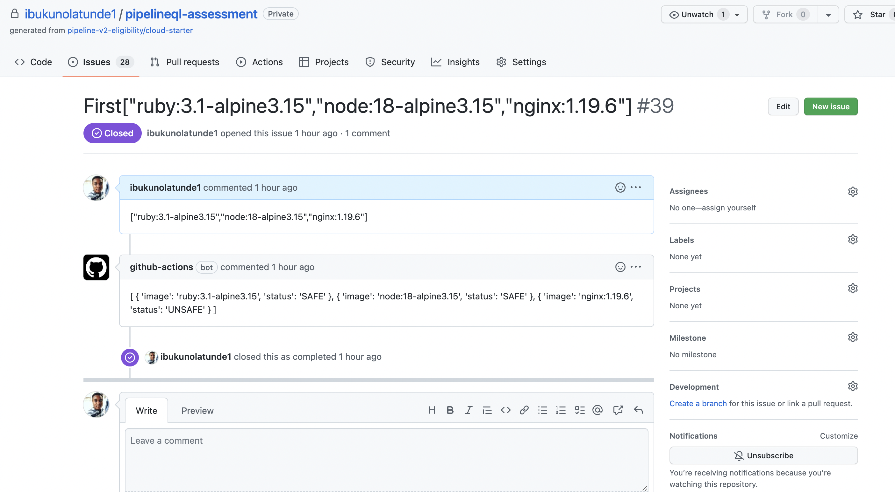

**HOW DOES THIS WORK**

**Objectives**

1. We need to scan a list of images and determine if the if the image is safe or not
2. Output the result in a specific json format as a comment on the issue raised

**Implementation**

Script Language: Bash

Using Aqua Security's Trivy tool, we can scan container images to determine if they are safe to use

1. Trivy is installed on the Github runner
3. The user input is process by reading the event body {{ github.event.issue.body }}, and also format it to a bash array by stripping the square brackets and removing the comma delimiter
```
            mystring=${{ github.event.issue.body }}
            images=$(echo $mystring | cut -d "[" -f2 | cut -d "]" -f1)
            IFS="," read -a IMAGES <<< $images
```
4. Next we iterate over the new array, and run trivy image with severity set to only HIGH and CRITICAL
```
            value=$(trivy image --quiet --ignore-unfixed --severity HIGH,CRITICAL $i | grep -i "Total" | awk '{print $2}')
```
5. A corresponding status array is created that can either have SAFE or UNSAFE as values
5. Merge both arrays into one array using the JQ utility, and do some formatting to conform to the output spec
```
            myValue=$(jq -n --arg names "${IMAGES[*]}" --arg value "${result[*]}" '{"name": ($names / " "), "title": ($value / " ")}')
            myNewValue=$(echo $myValue | jq '[.name, .title] | transpose | map( {image: .[0],status: .[1]})')
```
6. Send the formatted JSON to a json file
7. Use the Github API to send a post request on that issue ${{ github.event.issue.number }}, with the body being the JSON file
```
            curl -X POST -H "Accept: application/vnd.github+json" -H "Authorization: token ${{ secrets.GITHUB_TOKEN }}" https://api.github.com/repos/ibukunolatunde1/pipelineql-assessment/issues/${{ github.event.issue.number }}/comments -g -d @file.json
```

This is all run as a script in GitHub Actions and we have the results as
